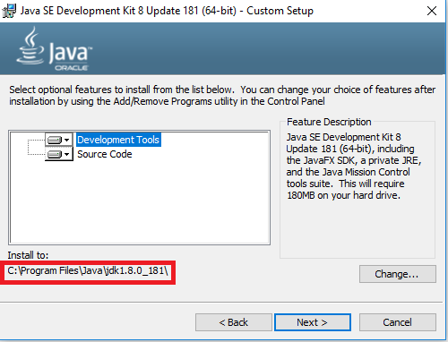

# Instalación y configuración de Hadoop en modo local (*standalone*)

Esta guía describe la instalación y configuración  de Apache Hadoop en modo standalone. 
Esta es la instalación más simple.

### Paso 1

Descargue Java SE Development Kit (JDE) 8u181 (jdk-8u181-linux-x64.tar.gz). 

http://www.oracle.com/technetwork/java/javase/downloads/jdk8-downloads-2133151.html

### Paso 2

En el explorador de archivos, descomprima el archivo `jdk-8u181-windows-x64.tar.gz`.

### Paso 3

Al ejecutar el instalador, cambie el directorio de instalación de Java por `C:\Java\jdk1.8.0_181` para la instalación de la primera disribución (JDK)

Luego, el instalador le pedirá una ruta para ubicar el archivo JRE. Cree un nuevo directorio desde el explorador de archivos `C:\Java\jre1.8.0_181` y redireccione la segunda instalación hacia el.

### Paso 4 

Descargue el archivo **binario** de Apache Hadoop 2.8.3 desde https://hadoop.apache.org/releases.html

### Paso 5

Descomprima el archivo desde el explorador de archivos, renombre el directorio como `hadoop` y ubiquelo en el archivo en el disco `C:`.

    `C:\hadoop\`
    

### Paso 6

Descargue el repositorio ##ZIP donde esté el bin## y corte y pegue todos los archivos de  `bin` reemplazando los contenidos del directorio `C:\hadoop\bin`

### Paso 7

Abra en el panel de control la opción  `Editar las variables de entorno del sistema` y realice los siguientes cambios:

> Agregue las siguientes variables

    HADOOP_HOME = C:\hadoop
    JAVA_HOME = C:\Java\jdk1.8.0_181
    HADOOP_CLASSPATH = %JAVA_HOME%\lib\tools.jar
    

    
> Modifique la variable PATH. Agregue:

    %HADOOP_HOME%\bin
    %JAVA_HOME%\bin

### Paso 8

Digite `hadoop` en la línea de comandos. 
Como resultado, debe imprimirse la ayuda de hadoop en la pantalla.

**Nota.--** En este paso, Apache Hadoop se puede ejecutar en modo *standalone*.

**Nota.--** Hadoop usará el sistema local de archivos como sistema HDFS.
